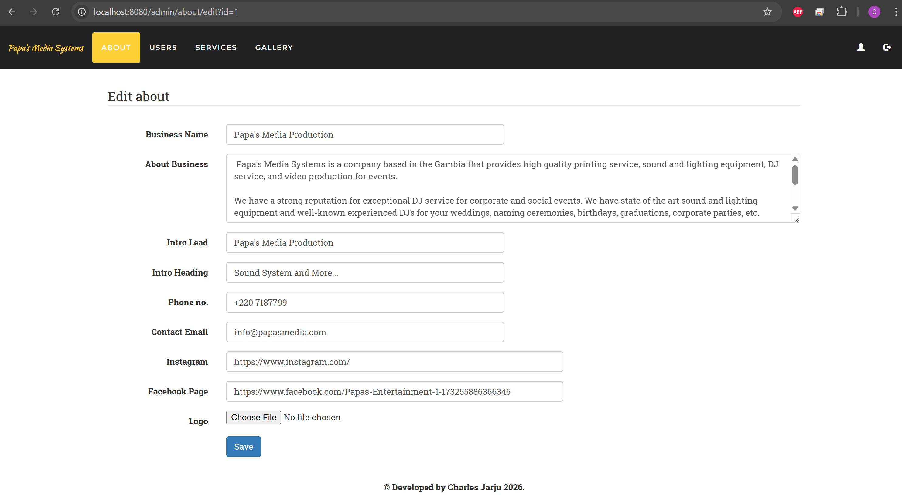
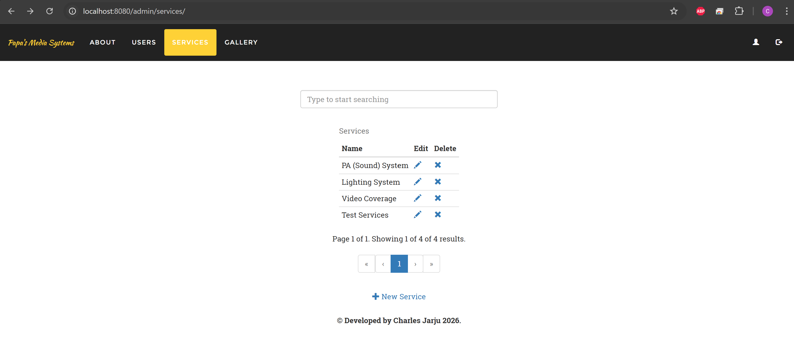

# About Project

Single-page PHP site for Papasmedia with a front-end asset pipeline powered by Gulp. The public content lives on one scrolling page rendered from [src/index.php](src/index.php), and is backed by Apache (PHP 8.1) and MySQL. Development uses BrowserSync proxying the internal container URL for live reload of SCSS and assets.

Key traits:

- Sections on one page: hero, about, services, gallery, contact; plus an admin area under [src/admin](src/admin) for managing content.
- Asset pipeline: SCSS → CSS, image optimization, and copying app files to [dist](dist) for production.
- Live reload dev workflow via BrowserSync (`gulp watch`) proxying the internal Apache container URL.

## System Dependencies

- Docker + Docker Compose (recommended)
- PHP 8.1 with Apache (containerized)
- MySQL 8.0 (containerized)
- Node.js 14.x for Gulp tasks

Optional local-only development requires PHP and MySQL installed locally; Docker is preferred.

## Getting Started

This section contains the steps necessary to get the application up and running.

### Prerequisites

1. Clone the repository:

   ```bash
   git clone <repository-url>
   cd papas1
   ```
2. Copy environment file:

   ```bash
   cp .env.example .env
   ```
3. Edit `.env` as needed:
   - `APP_URL=http://localhost:8080` (external access)
   - `APP_INTERNAL_URL=http://php-apache:80` (used by BrowserSync)
   - `ENV_DIR=src` for development or `ENV_DIR=dist` for production
   - MySQL credentials (match defaults in example if unsure)

### Containerized Setup (recommended)

1. Build images:

   ```bash
   docker compose build
   ```

2. Start services (Apache/PHP, MySQL):

   ```bash
   docker compose up -d mysql php-apache
   ```

3. Install Node dependencies and build assets (runs in a Node container):

   ```bash
   docker compose run --rm node
   ```

   This compiles SCSS, optimizes images, and copies files to [dist](dist).

4. Create the database:

   ```bash
   docker compose exec mysql \
     sh -c 'MYSQL_PWD="${MYSQL_ROOT_PASSWORD}" \
       mysql -u root -e "CREATE DATABASE IF NOT EXISTS ${MYSQL_DATABASE}"'
   ```

5. Import the sample dataset:

   ```bash
   docker compose exec -T mysql \
     sh -c 'MYSQL_PWD="${MYSQL_ROOT_PASSWORD}" mysql -u root ${MYSQL_DATABASE}' \
     < src/assets/data/webapp01.sql
   ```

6. Access the site:

   - App: http://localhost:8080

7. Live development (optional):

   - Ensure `ENV_DIR=src` in `.env` so Apache serves [src](src).
   - Set `APP_INTERNAL_URL=http://php-apache:80`.
   - Run BrowserSync with watch:

     ```bash
     docker compose run -p 3000:3000 --rm node \
       sh -c "npm install && npx gulp watch"
     ```

   This watches SCSS and reloads the browser on changes while proxying the internal Apache URL.

8. Production build and serve [dist](dist):

   ```bash
   docker compose run --rm node sh -c "npm install && npx gulp build"
   # switch Apache to serve dist
   sed -i 's/^ENV_DIR=.*/ENV_DIR=dist/' .env
   docker compose restart php-apache
   ```

#### Useful Docker Compose commands

```bash
docker compose up            # (re)create the services
docker compose stop          # stop the services
docker compose start         # start the services
docker compose restart       # restart the services
docker compose down          # teardown the services
```

## Project Structure

- [src](src): PHP pages, assets, includes, and admin.
- [dist](dist): Built production files (output of Gulp build).
- [tasks](tasks): Build helper scripts.
- [gulpfile.js](gulpfile.js): Gulp tasks (build, watch, styles, images).
- [compose.yml](compose.yml): Docker Compose services (php-apache, mysql, node).
- [Dockerfile](Dockerfile): Apache + PHP 8.1 container.

## Teaser

<div style="margin-left: 50px">






</div>

## License

The project is licensed under the MIT License. Refer to [LICENSE](LICENSE) for more information.
